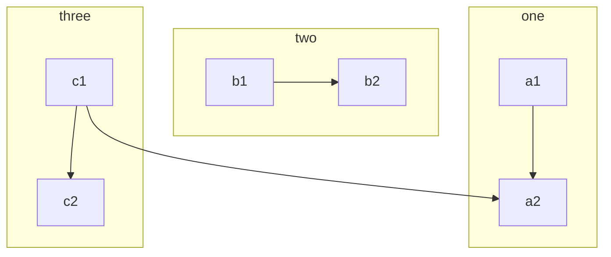
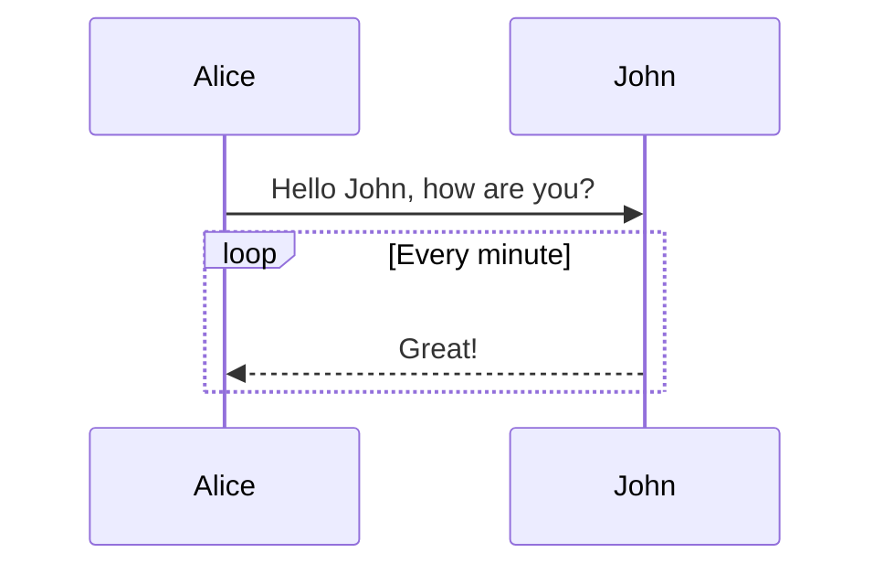
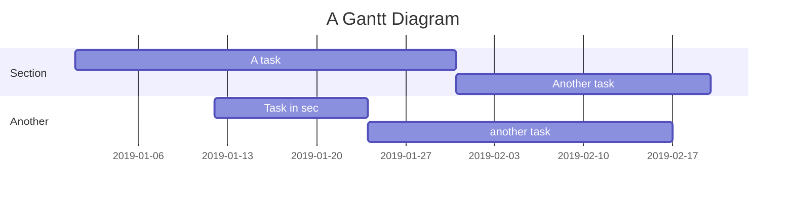
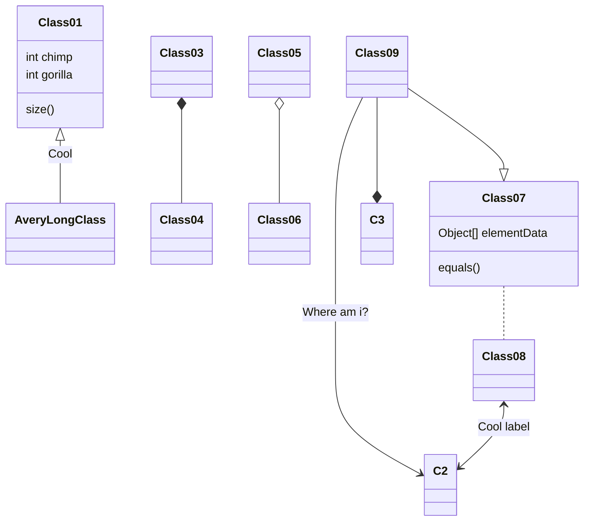
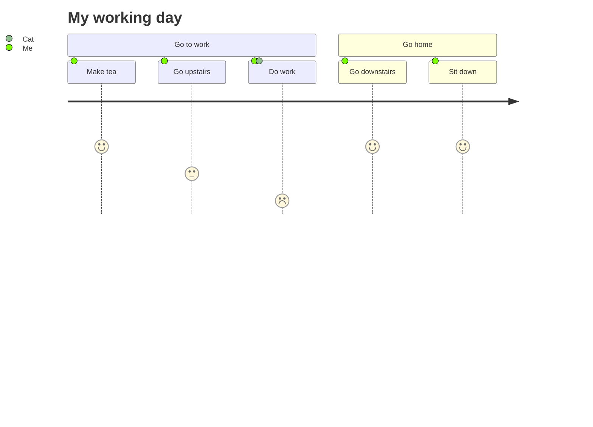
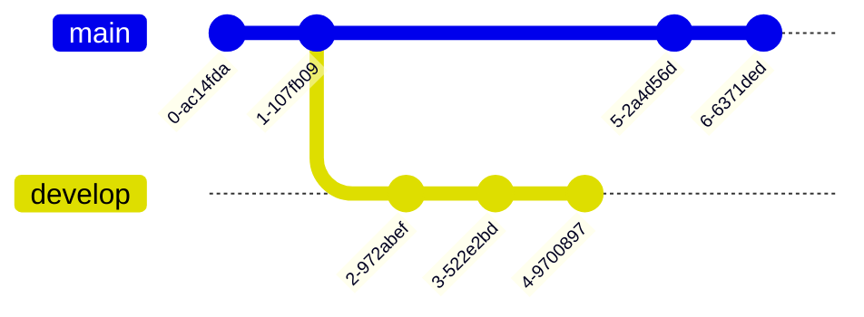
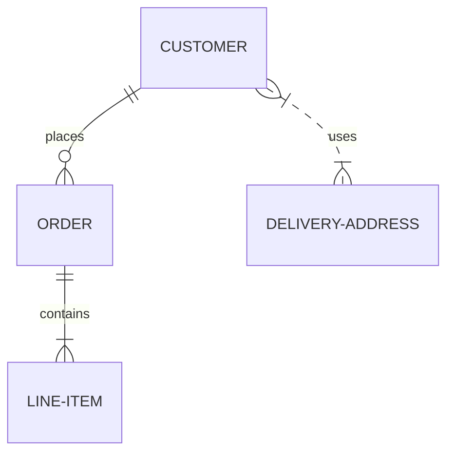
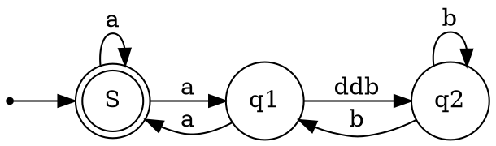
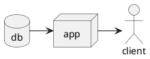

<!-- more -->


# 排版元素

## 行级元素

* 请从这里开始
* [超级链接](https://ld246.com)
* 图片

  可通过复制粘贴或拖拽来上传图片；上传后的图片可通过拖拽进行大小调整。

  
* **加粗**
* *倾斜*
* <u>下划线</u>
* ~~删除线~~
* <span style="font-weight: bold;" class="mark">标记</span>
* ^上标^
* ~下标~
* <kbd>快捷键</kbd>
*  #标签#
* `行级代码`
* $a^2 + b^2 = \color{red}c^2$
* 备注^（这是一个行级备注）^
* **颜色 1** **颜色 2**  **颜色 3** **颜色 4** **颜色 5** **颜色 6** **颜色 7** **颜色 8** **颜色 9** **颜色 10** **颜色 11** **颜色 12** **颜色 13** 

  **特效 1** **特效 2**
* 通过输入 `:` 加字母触发表情字符搜索 😄 😆 😵 😭 😰 😅  😢 😤 😍 😌👍 👎 💯 👏 🔔 🎁 ❓ 💣 ❤️ ☕️ 🌀 🙇 💋 🙏 💢

## 超级块

段落一

段落二居中

段落三

段落四居右

## 嵌入块

> 在思源中，唯一重要的核心概念是内容块。通过排版格式即可形成内容块，这样我们就能在块级粒度上对思绪和知识进行整理，同时也能方便长文阅读和输出。

## 标题块

## 有序、无序、任务列表

### 无序列表

* Java

  * Spring

    * IoC
    * AOP
* Go

  * gofmt
  * Wide
* Node.js

  * Koa
  * Express

### 有序列表

1. Node.js

    1. Express
    2. Koa
    3. Sails
2. Go

    1. gofmt
    2. Wide
3. Java

    1. Latke
    2. IDEA

### 任务列表

* [X] 发布思源
* [ ] 预约牙医

## 引述块

> 注意不是内容块引用，而是引述块（Blockquote）。

## 代码块

如果在 ``` 后面跟随语言名称，可以有语法高亮的效果哦，比如：

### 演示 Go 代码高亮

```go
package main

import "fmt"

func main() {
	fmt.Println("Hello, 世界")
}
```

### 演示 Java 高亮

```java
public class HelloWorld {

    public static void main(String[] args) {
        System.out.println("Hello World!");
    }

}
```

> Tip: 语言名称支持下面这些： `ruby`, `python`, `js`, `html`, `erb`, `css`, `coffee`, `bash`, `json`, `yml`, `xml` ...

## 表格

|header 1|header 2|
| ----------| ----------|
|cell 1|cell 2|
|cell 3|cell 4|
|cell 5|cell 6|

## HTML 块

<div>
<ruby>
你<rt>nǐ</rt>
　好<rt>　hǎo</rt>
　世<rt>　shì</rt>
　界<rt>　jiè</rt>
</ruby><br>
Hello World
</div>

#注意#：

* 使用 HTML 块时不会对其中的代码进行安全过滤，请确认代码安全后再使用，以免遭遇跨站脚本攻击（XSS）
* 因为 Markdown 规范对 HTML 块解析规则较为复杂，建议使用 `<div></div>` 包裹 HTML 代码并去掉空行

## 分隔线

---

## 数学公式

$$
\frac{1}{
  \Bigl(\sqrt{\phi \sqrt{5}}-\phi\Bigr) e^{
  \frac25 \pi}} = 1+\frac{e^{-2\pi}} {1+\frac{e^{-4\pi}} {
    1+\frac{e^{-6\pi}}
    {1+\frac{e^{-8\pi}}{1+\cdots}}
  }
}
$$

## IFrame

<iframe src="https://player.bilibili.com/player.html?bvid=BV1ov41187qM&amp;page=1&amp;high_quality=1&amp;as_wide=1&amp;allowfullscreen=true&amp;aid=247401039&amp;cid=319662466&amp;autoplay=0" data-src="//player.bilibili.com/player.html?aid=247401039&amp;bvid=BV1ov41187qM&amp;cid=319662466&amp;page=1" scrolling="no" border="0" frameborder="no" framespacing="0" allowfullscreen="true" style="width: 981px; height: 440px;" sandbox="allow-top-navigation-by-user-activation allow-same-origin allow-forms allow-scripts allow-popups"></iframe>

## 视频

## 音频

## 脑图

```mindmap
- 教程
- 语法指导
  - 普通内容
  - 提及用户
  - 表情符号 Emoji
    - 一些表情例子
  - 大标题 - Heading 3
    - Heading 4
      - Heading 5
        - Heading 6
  - 图片
  - 代码块
    - 普通
    - 语法高亮支持
      - 演示 Go 代码高亮
      - 演示 Java 高亮
  - 有序、无序、任务列表
    - 无序列表
    - 有序列表
    - 任务列表
  - 表格
  - 隐藏细节
  - 段落
  - 链接引用
  - 数学公式
  - 脑图
  - 流程图
  - 时序图
  - 甘特图
  - 图表
  - 五线谱
  - Graphviz
  - 多媒体
  - 脚注
- 快捷键
```

使用 Markdown 列表语法渲染脑图。

## 流程图



语法请参考 [Mermaid](https://mermaid.js.org/)。

## 时序图



语法请参考 [Mermaid](https://mermaid.js.org/)。

## 甘特图



语法请参考 [Mermaid](https://mermaid.js.org/)。

## 类图



语法请参考 [Mermaid](https://mermaid.js.org/)。

## 用户游历图



语法请参考 [Mermaid](https://mermaid.js.org/)。

## Git 图



语法请参考 [Mermaid](https://mermaid.js.org/)。

## 实体关系图



语法请参考 [Mermaid](https://mermaid.js.org/)。

## 图表

```echarts
{
  "title": { "text": "最近 30 天" },
  "backgroundColor": "transparent",
  "tooltip": { "trigger": "axis", "axisPointer": { "lineStyle": { "width": 0 } } },
  "legend": { "data": ["帖子", "用户", "回帖"] },
  "xAxis": [{
      "type": "category",
      "boundaryGap": false,
      "data": ["2019-05-08","2019-05-09","2019-05-10","2019-05-11","2019-05-12","2019-05-13","2019-05-14","2019-05-15","2019-05-16","2019-05-17","2019-05-18","2019-05-19","2019-05-20","2019-05-21","2019-05-22","2019-05-23","2019-05-24","2019-05-25","2019-05-26","2019-05-27","2019-05-28","2019-05-29","2019-05-30","2019-05-31","2019-06-01","2019-06-02","2019-06-03","2019-06-04","2019-06-05","2019-06-06","2019-06-07"],
      "axisTick": { "show": false },
      "axisLine": { "show": false }
  }],
  "yAxis": [{ "type": "value", "axisTick": { "show": false }, "axisLine": { "show": false }, "splitLine": { "lineStyle": { "color": "rgba(0, 0, 0, .38)", "type": "dashed" } } }],
  "series": [
    {
      "name": "帖子", "type": "line", "smooth": true, "itemStyle": { "color": "#d23f31" }, "areaStyle": { "normal": {} }, "z": 3,
      "data": ["18","14","22","9","7","18","10","12","13","16","6","9","15","15","12","15","8","14","9","10","29","22","14","22","9","10","15","9","9","15","0"]
    },
    {
      "name": "用户", "type": "line", "smooth": true, "itemStyle": { "color": "#f1e05a" }, "areaStyle": { "normal": {} }, "z": 2,
      "data": ["31","33","30","23","16","29","23","37","41","29","16","13","39","23","38","136","89","35","22","50","57","47","36","59","14","23","46","44","51","43","0"]
    },
    {
      "name": "回帖", "type": "line", "smooth": true, "itemStyle": { "color": "#4285f4" }, "areaStyle": { "normal": {} }, "z": 1,
      "data": ["35","42","73","15","43","58","55","35","46","87","36","15","44","76","130","73","50","20","21","54","48","73","60","89","26","27","70","63","55","37","0"]
    }
  ]
}
```

可使用如下三种格式定义：

* JSON

  ```json
  {
      "propName": "propValue"
  }
  ```
* JavaScript Object

  ```javascript
  {
      propName: 'propValue',
  }
  ```
* 返回一个 JavaScript Object 的立即执行函数

  ```javascript
  (() => {
      const option = {};
      option.propName = `propValue`;
      return option;
  })()
  ```

具体语法请参考 [ECharts](https://echarts.apache.org/zh/index.html)。

## 五线谱

```abc
X: 24
T: Clouds Thicken
C: Paul Rosen
S: Copyright 2005, Paul Rosen
M: 6/8
L: 1/8
Q: 3/8=116
R: Creepy Jig
K: Em
|:"Em"EEE E2G|"C7"_B2A G2F|"Em"EEE E2G|\
"C7"_B2A "B7"=B3|"Em"EEE E2G|
"C7"_B2A G2F|"Em"GFE "D (Bm7)"F2D|\
1"Em"E3-E3:|2"Em"E3-E2B|:"Em"e2e gfe|
"G"g2ab3|"Em"gfeg2e|"D"fedB2A|"Em"e2e gfe|\
"G"g2ab3|"Em"gfe"D"f2d|"Em"e3-e3:|
```

语法请参考 abcjs (github repo: paulrosen/abcjs)。

## Graphviz



语法请参考 [Graphviz](https://graphviz.org)。

## Flowchart

```flowchart
st=>start: Start
op=>operation: Your Operation
cond=>condition: Yes or No?
e=>end

st->op->cond
cond(yes)->e
cond(no)->op
```

语法请参考 [flowchart.js](https://flowchart.js.org/)。

## PlantUML



语法请参考 [PlantUML](https://plantuml.com)。
